# ✈️ Turbofan Engine RUL Predictor
### Predicting Jet Engine Failure Through Machine Learning


> An **AI4ALL Ignite** group project by **Team 04C**. We train a model on turbofan
> sensor telemetry to predict a jet engine's **Remaining Useful Life (RUL)** — how
> many flight cycles remain before failure — so airlines can move from *fixed*
> replacement schedules to **predictive maintenance**.

**🔗 Live app:** **[jet-engineml.streamlit.app](https://jet-engineml.streamlit.app)** &nbsp;·&nbsp; **📊 Model:** Random Forest — **RMSE 18.0 / MAE 13.3 / R² 0.81** on unseen engines

---

## 📑 Table of Contents

1. [The Problem](#-the-problem)
2. [Dashboard](#-dashboard)
3. [System Architecture](#-system-architecture)
4. [The Dataset](#-the-dataset)
5. [Exploratory Data Analysis](#-exploratory-data-analysis)
6. [Modeling Approach](#-modeling-approach)
7. [Results](#-results)
8. [How the Dashboard Works](#-how-the-dashboard-works)
9. [Getting Started](#-getting-started)
10. [Project Structure](#-project-structure)
11. [Design Decisions](#-design-decisions)
12. [Limitations & Future Work](#-limitations--future-work)
13. [The Team](#-the-team)
14. [Acknowledgments & References](#-acknowledgments--references)

---

## 🛩️ The Problem

Jet engines are today maintained on **fixed schedules** — replaced or serviced after
a set number of flight cycles, whether or not they actually need it. That is safe but
wasteful: healthy engines get pulled early, and the occasional engine degrades faster
than the schedule assumes.

**Research question:** *Can machine learning predict early engine failure from sensor
telemetry, to support predictive maintenance and reduce unexpected downtime?*

If we can estimate an engine's **Remaining Useful Life (RUL)** — the number of flight
cycles left before failure — from its sensors, maintenance can be scheduled *per
engine, by condition*, instead of by a one-size-fits-all calendar. This project builds
that estimator and wraps it in an interactive dashboard.

---

## 🖥️ Dashboard

The Streamlit app has three modes, all backed by the same trained model.

> ### ▶️ **[Try it live → jet-engineml.streamlit.app](https://jet-engineml.streamlit.app)**
> The deployed dashboard trains its model on startup from the committed dataset — no
> setup required.

### 1. Browse engine
Pick one of the 100 training engines and scrub through its life cycle by cycle, watching
its predicted RUL update. Below, engine 1 at its final cycle (192) is correctly predicted
at just **4 cycles** of life remaining:

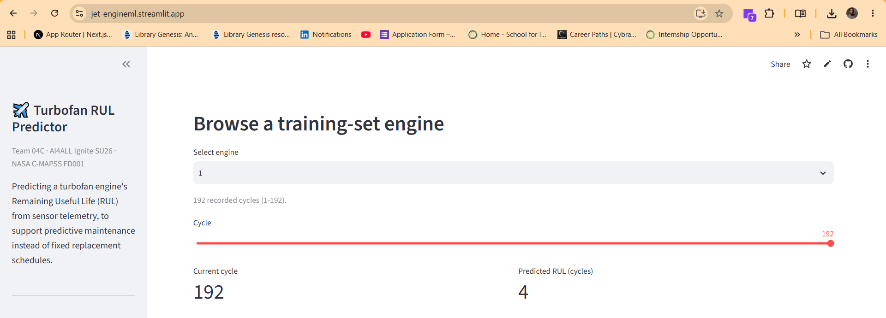

The sensor charts show the characteristic upward drift near failure — the degradation
signal the model keys on:

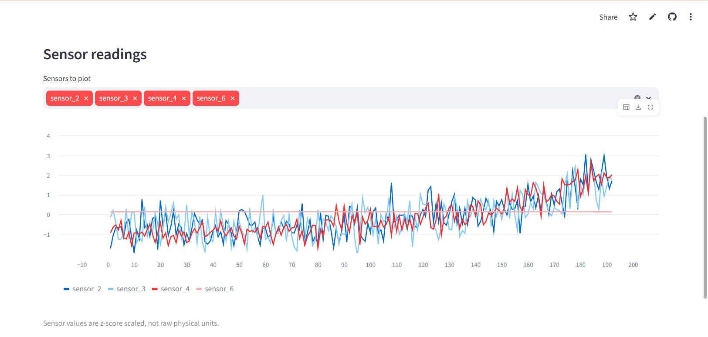

### 2. Upload CSV
Upload pre-scaled sensor readings; the app validates the 16 required columns and previews
the data:

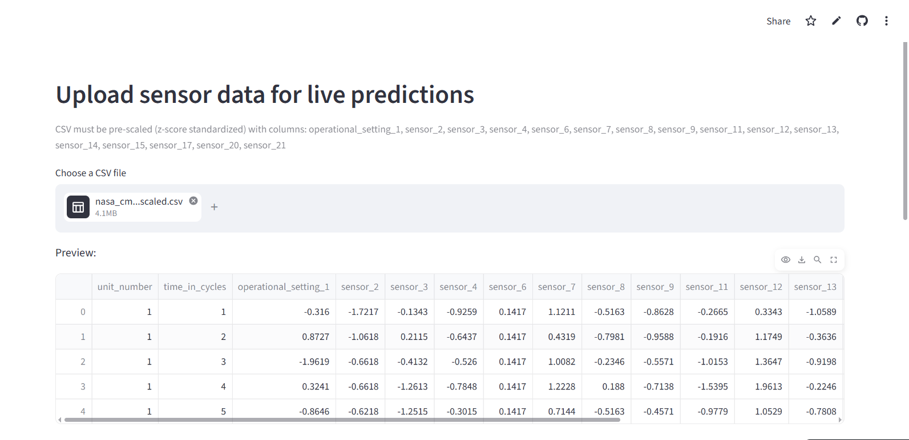

…then returns a predicted RUL for every row, downloadable as a results CSV:

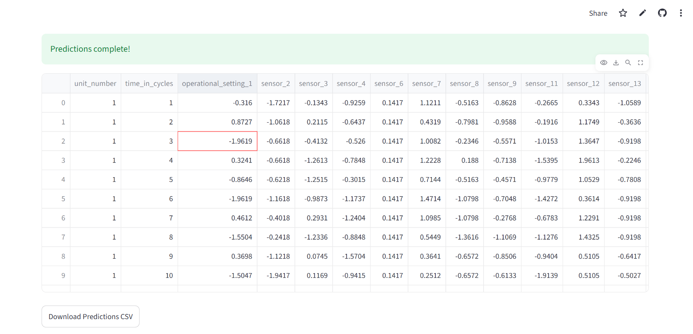

### 3. Manual input
Hand-enter a single engine's 16 sensor/setting values for an instant prediction with a
color-coded maintenance recommendation (🟢 healthy / 🟠 inspect / 🔴 maintenance soon):

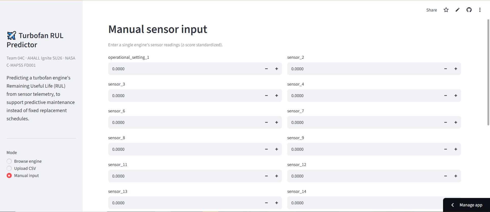

---

## 🏗️ System Architecture

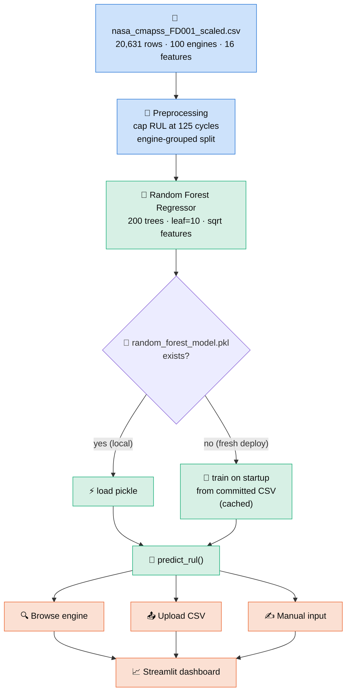

**The key architectural decision** is that the app is **self-sufficient**: the trained
model pickle is ~28 MB and *not* committed (it exceeds GitHub limits when large, and
would drift from the code). Instead, on a fresh cloud deployment the app **trains the
model once on startup** from the committed dataset and caches it. No external files, no
manual steps — clone and run.

---

## 📊 The Dataset

We use **NASA's C-MAPSS FD001** turbofan degradation dataset — a standard
run-to-failure benchmark in prognostics. Each engine runs from healthy operation until
failure, logging sensor readings every flight cycle.

| Property | Value |
|---|---|
| Rows (engine-cycles) | **20,631** |
| Engines (units) | **100** |
| Cycles per engine | 128 – 362 |
| Model features | **16** (1 operational setting + 15 sensors) |
| Target | `RUL` — cycles until failure |
| Scaling | all features **z-score standardized** (not raw physical units) |

### Data dictionary

| Column | Meaning |
|---|---|
| `unit_number` | Engine ID (1–100) |
| `time_in_cycles` | Flight cycle index for that engine |
| `operational_setting_1` | Flight-condition setting (scaled) |
| `sensor_2 … sensor_21` | 15 retained sensor channels (scaled): temperatures, pressures, fan/core speeds, flow ratios |
| `RUL` | **Target** — remaining useful life in cycles |

> ⚠️ **Values are z-scored**, so a reading of `1.4` means "1.4 standard deviations
> above the fleet mean," *not* a temperature or pressure. All UI copy says "scaled
> sensor reading" rather than °F/psi. Uninformative/constant FD001 channels (sensors
> 1, 5, 10, 16, 18, 19) were dropped upstream.

---

## 🔬 Exploratory Data Analysis

### 1. The target is skewed — which motivates a cap

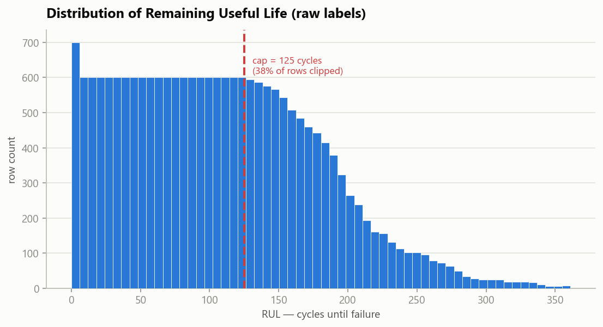

Raw RUL ranges from 0 to 361, but early in an engine's life the exact RUL is
**unpredictable** (a healthy engine looks the same at 300 vs. 250 cycles remaining).
Nearly **39%** of rows sit above 125. We therefore apply the standard **piecewise-linear
cap at 125 cycles** — the model learns to say "plenty of life left" above the cap and
focuses its capacity on the degradation window that actually matters.

### 2. Sensors drift systematically as failure approaches

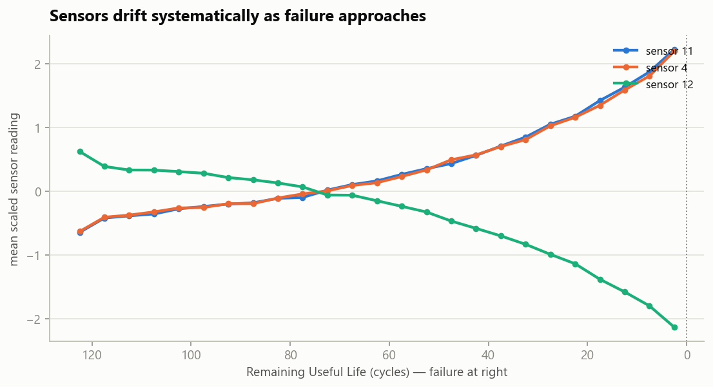

This is *why the problem is learnable*. Averaged across all engines, key sensors move
monotonically as RUL → 0: sensors 11 and 4 climb while sensor 12 falls. The signal is
faint far from failure and grows sharp near it — exactly the regime predictive
maintenance cares about.

### 3. Many features carry a real linear signal

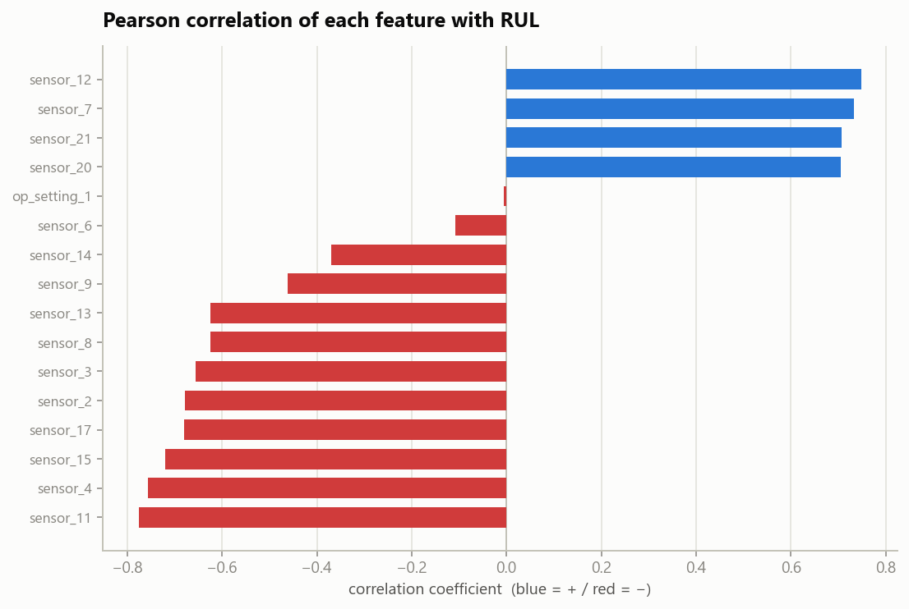

Pearson correlation with RUL confirms the degradation story: several sensors correlate
strongly (positively or negatively) with remaining life, so even a linear baseline has
something to grip. The Random Forest additionally captures **nonlinear** interactions a
correlation can't show.

---

## 🧠 Modeling Approach

### Features & target
- **16 inputs:** `operational_setting_1` + 15 scaled sensors.
- **Target:** RUL, **capped at 125** (piecewise-linear).

### Why an engine-grouped split
A random row-level train/test split would leak: cycles from the *same* engine would
land in both sets, and the model could "memorize" that engine. We use
`GroupShuffleSplit` on `unit_number` (75 train / 25 test engines) so **every test
engine is completely unseen** — the metrics reflect generalization to new hardware.

### The model
A tuned **`RandomForestRegressor`**, chosen as the team's primary model because it
captures nonlinear degradation and sensor interactions while staying interpretable via
feature importances.

```python
RandomForestRegressor(
    n_estimators=200,
    min_samples_leaf=10,   # tuned: matches a heavier model's accuracy…
    max_features="sqrt",   # …while cutting pickle size ~4× and train time ~2×
    random_state=42,
    n_jobs=-1,
)
```

### Baseline for comparison
`logistic_regression_base.py` frames the same problem two ways on the identical
grouped split — **logistic** classification ("will this engine fail within 30 cycles?")
vs. **linear** regression on capped RUL — and scores both on a shared board, including
the asymmetric **C-MAPSS score** that penalizes *late* predictions (an engine predicted
to last longer than it does) harder than early ones, because in maintenance a late
prediction is the dangerous one.

---

## 🎯 Results

Evaluated on the **25 held-out engines** the model never saw during training:

| Metric | Score | Reading |
|---|---:|---|
| **RMSE** | **18.0 cycles** | typical error magnitude |
| **MAE** | **13.3 cycles** | median-ish absolute error |
| **R²** | **0.81** | 81% of RUL variance explained |

### Predicted vs. actual

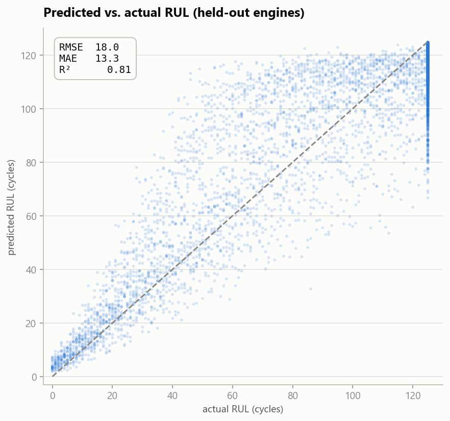

Predictions hug the diagonal, and — crucially for maintenance — **tighten as RUL → 0**,
where accuracy matters most. The dense vertical band at 125 is the RUL cap.

### Error is roughly unbiased

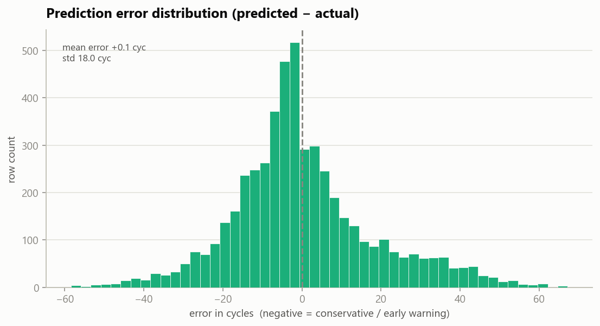

Residuals center near zero with no large systematic bias; the left tail (conservative /
early-warning errors) is the *safer* direction to err in.

### What the model relies on

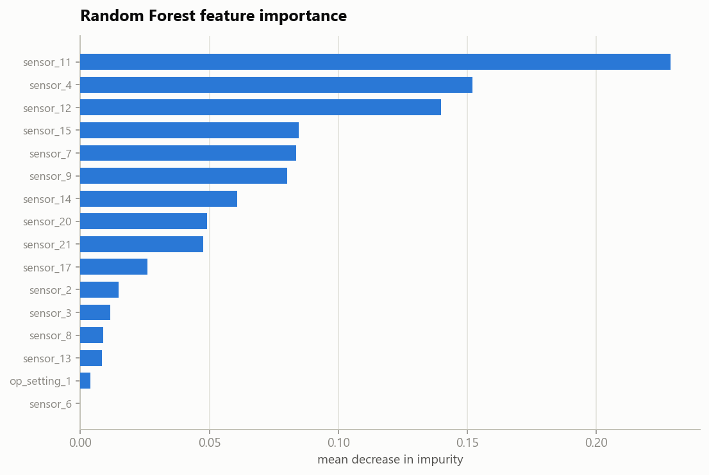

Importance is spread across sensors 11, 4, 12, 15, 7 and 9 rather than dominated by one
— a robust signal, consistent with the degradation and correlation plots above.

### What we tried that *didn't* help
Being honest about the ceiling: on this dataset and feature set, tree models top out
around **RMSE 18**. We tested **rolling-window temporal features** (per-engine moving
mean/std) and **gradient boosting** — neither beat the tuned Random Forest, so we kept
the simpler, leaner model.

---

## ⚙️ How the Dashboard Works

All three modes call one function, `predict_rul()` in [`model.py`](model.py):

| Mode | Input | Output |
|---|---|---|
| **Browse engine** | an engine + cycle from the dataset | predicted RUL + sensor charts over its life |
| **Upload CSV** | a pre-scaled CSV with the 16 feature columns | predicted RUL per row + downloadable results |
| **Manual input** | 16 hand-entered scaled values | one prediction + 🟢/🟠/🔴 maintenance flag |

When no pre-trained pickle is present (e.g. a fresh deploy), the app **trains the model
in-process from the committed CSV**, cached via `@st.cache_resource`, and degrades
gracefully to a clearly-labeled placeholder heuristic if training ever fails — so the
app never hard-crashes on the user.

---

## 🚀 Getting Started

### Prerequisites
- Python 3.9+
- `pip`

### Setup
```bash
git clone https://github.com/William-franklyn/Jet-Engine-Predictive-Maintenance-ML.git
cd Jet-Engine-Predictive-Maintenance-ML
pip install -r requirements.txt
```

### Run the dashboard
```bash
# optional: pre-train the model (otherwise the app trains it on first load, ~10s)
python save_model.py

streamlit run app.py
```

### Reproduce the figures in this README
```bash
pip install matplotlib
python scripts/generate_figures.py     # writes docs/images/*.png
```

### Run the baseline comparison
```bash
python logistic_regression_base.py
```

---

## 🗂️ Project Structure

```
Jet-Engine-Predictive-Maintenance-ML/
├── app.py                          # Streamlit dashboard (3 modes)
├── model.py                        # predict_rul(), feature list, model loader
├── save_model.py                   # trains + saves the RF; exposes train_full_model()
├── logistic_regression_base.py     # logistic vs linear baseline on the same split
├── scripts/
│   └── generate_figures.py         # regenerates the README visualizations
├── docs/images/                    # generated charts + dashboard screenshots
├── nasa_cmapss_FD001_scaled.csv    # the dataset (single source of truth)
├── requirements.txt
├── README.md
└── CLAUDE.md                       # engineering notes / conventions
```

---

## 🧩 Design Decisions

| Decision | Why |
|---|---|
| **One dataset as the single source of truth** | The whole project (baseline, trainer, all dashboard modes) reads `nasa_cmapss_FD001_scaled.csv`, so it trains and runs with **zero external file dependencies**. |
| **Cap RUL at 125** | Early-life RUL is unpredictable; the piecewise-linear cap focuses the model on the degradation window and is the C-MAPSS convention. |
| **Engine-grouped split** | Prevents leakage — reported metrics reflect *unseen engines*, not memorized ones. |
| **Lean Random Forest** | `leaf=10 / 200 trees` matches a heavier model's accuracy at ¼ the size, so the app can train on startup within free-tier memory. |
| **Train-on-startup, not a committed binary** | Keeps the model in sync with code/data and avoids shipping a large pickle to git. |
| **Graceful degradation** | Any environment/training failure falls back to a placeholder instead of crashing the deployed app. |

---

## 🔭 Limitations & Future Work

- **Metric scope.** We report error over *all* cycles; the official C-MAPSS benchmark
  scores only the last cycle of each test engine. Our numbers are an honest internal
  metric, not directly comparable to leaderboard RMSE.
- **Single operating condition.** FD001 is the simplest C-MAPSS subset (one condition,
  one fault mode). FD002–FD004 add operating regimes and fault modes.
- **No temporal model yet.** An **LSTM** could exploit the full time series and is the
  natural next step (the deck lists it as future work; it does not exist in this repo).
- **Scaling assumptions.** The app expects inputs pre-scaled with the same statistics as
  training; a productionized version would bundle the scaler.

---

## 👥 The Team

This project is a **team achievement of AI4ALL Ignite — Team 04C**. Built collaboratively
by:

| | | |
|---|---|---|
| **William Frank Mahunda** | **Tom Chatto** | **Gabe Meredith** |
| **Nish Methuku** | **Alejandro Hernandez** | **Erronn Bridgewater** |
| **Hunter Ngo** | | |

From data preprocessing and exploratory analysis to modeling, evaluation, and the
deployed dashboard — every piece came together through the group's shared work during
the AI4ALL Ignite program. 💙

---

## 🙏 Acknowledgments & References

- **AI4ALL Ignite** — for the program, mentorship, and framing around responsible AI.
- **NASA Prognostics Center of Excellence** — *C-MAPSS Turbofan Engine Degradation
  Simulation Data Set* (FD001). A. Saxena, K. Goebel, D. Simon, and N. Eklund,
  "Damage propagation modeling for aircraft engine run-to-failure simulation," *2008
  International Conference on Prognostics and Health Management*.
- **scikit-learn**, **Streamlit**, **pandas**, **NumPy**, **Matplotlib** — the open-source
  stack this project is built on.

---

<div align="center">
<sub>Built with 💙 by AI4ALL Ignite Team 04C · Predicting jet engine failure to make maintenance smarter and flights safer.</sub>
</div>
